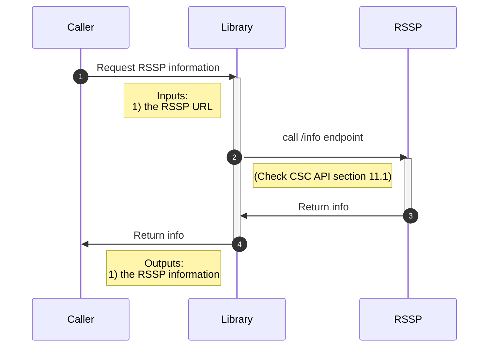
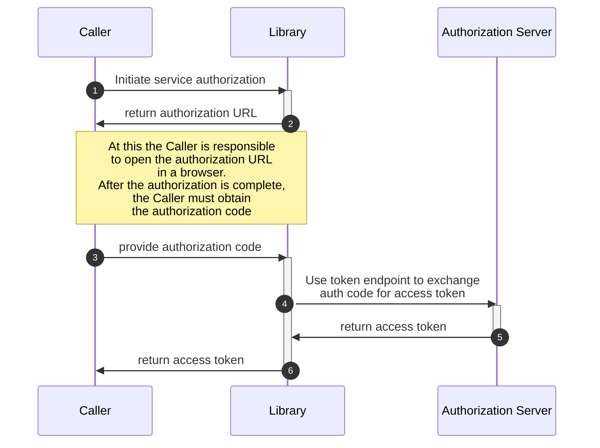
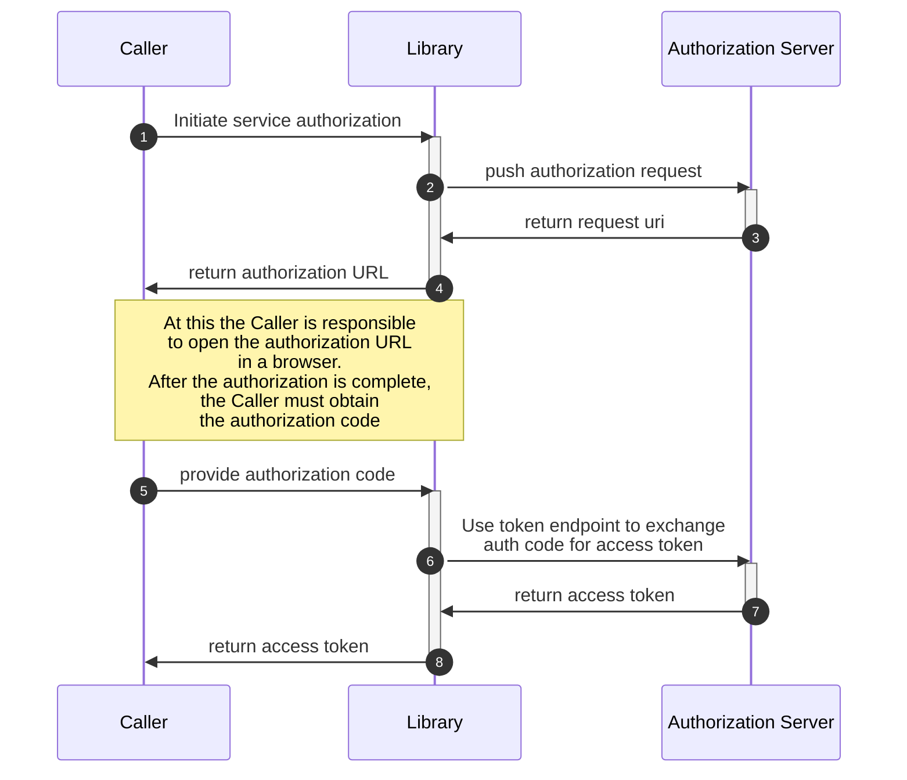
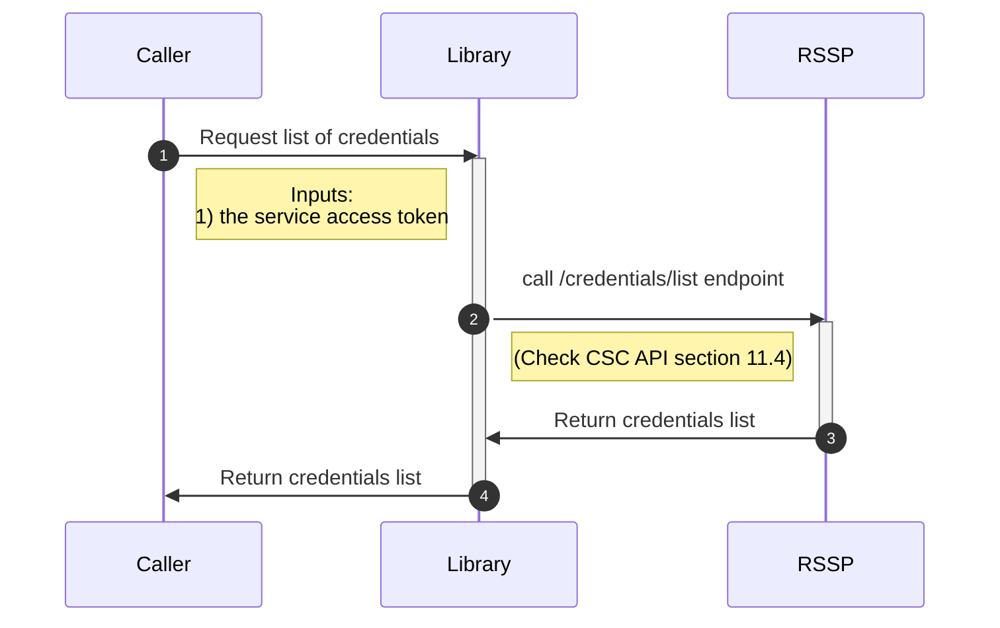
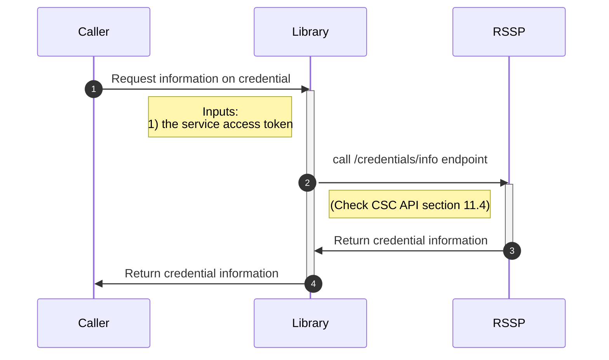
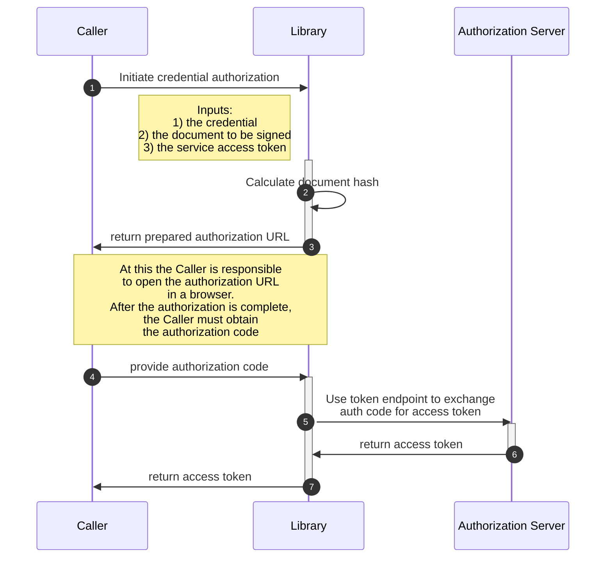
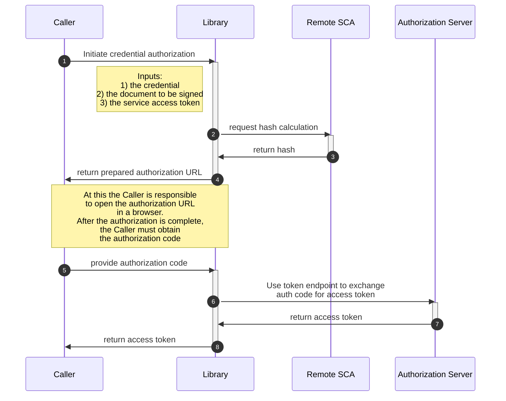
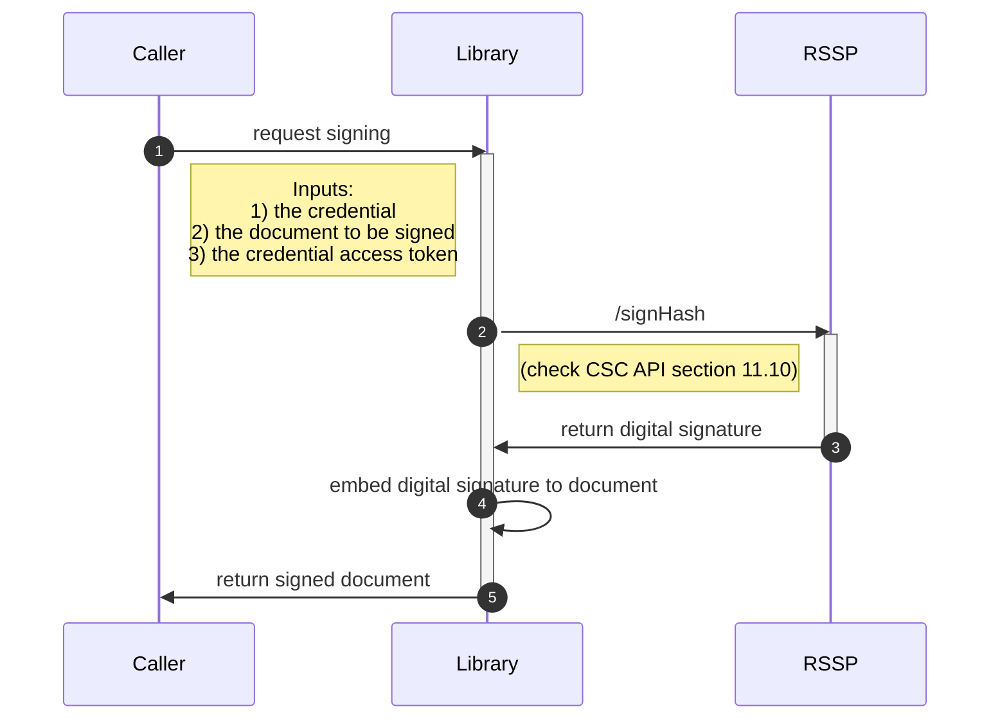

# EUDI rQES CSC library

:heavy_exclamation_mark: **Important!** Before you proceed, please read
the [EUDI Wallet Reference Implementation project description](https://github.com/eu-digital-identity-wallet/.github/blob/main/profile/reference-implementation.md)

[](https://www.apache.org/licenses/LICENSE-2.0)

## Table of contents

* [Overview](#overview)
* [Disclaimer](#disclaimer)
* [Use cases supported](#use-cases-supported)
   1. [Getting Started (UPDATED 26/11/2024)](#getting-started-updated-26112024)
* [Configuration options](#configuration-options)
* [Other features](#other-features)
* [Features not supported](#features-not-supported)
* [How to contribute](#how-to-contribute)
* [License](#license)

See [CHANGELOG.md](./CHANGELOG.md) for the latest updates.

## Overview

This is a Swift library, targeting JVM, that supports the [Cloud Signature Consortium API (version 2)](https://cloudsignatureconsortium.org/wp-content/uploads/2023/04/csc-api-v2.0.0.2.pdf) protocol.

## Interactions between the library, the caller and the RSSP

#### Legend

|            |                                                                                     |
| ---------- | ----------------------------------------------------------------------------------- |
| Caller     | The application that is using the library to interact with the RSSP                 |
| Lib        | This library                                                                        |
| RSSP       | The Remote Signing Service Provider                                                 |
| Remote SCA | A remote component that is responsible for hash calculation and signature embedding |

### Get RSSP information



### Service authorization

#### Authorization Code flow



#### Authorization Code flow with Pushed Authorization Requests (PAR)



### Credentials list




### Credentials info




### Credential Authorization flow



### Credential Authorization flow with remote SCA



### Document signing



## Disclaimer

The released software is an initial development release version:
-  The initial development release is an early endeavor reflecting the efforts of a short timeboxed period, and by no means can be considered as the final product.
-  The initial development release may be changed substantially over time, might introduce new features but also may change or remove existing ones, potentially breaking compatibility with your existing code.
-  The initial development release is limited in functional scope.
-  The initial development release may contain errors or design flaws and other problems that could cause system or other failures and data loss.
-  The initial development release has reduced security, privacy, availability, and reliability standards relative to future releases. This could make the software slower, less reliable, or more vulnerable to attacks than mature software.
-  The initial development release is not yet comprehensively documented.
-  Users of the software must perform sufficient engineering and additional testing in order to properly evaluate their application and determine whether any of the open-sourced components is suitable for use in that application.
-  We strongly recommend to not put this version of the software into production use.
-  Only the latest version of the software will be supported


# Use cases supported

## Getting Started (UPDATED 26/11/2024)

#### **Code Example (Walkthrough: Initializing RQES to Get Signed Documents):**

#### **To observe the full functionality of the RQES library.**
#### Create a Swift console application, integrate the rqes library, and execute the provided code.


#### EXAMPLE CONSOLE SWIFT

``` swift
import Foundation
import RQESLib


class RQESHandler {
    
    public static func start() async throws {
        
        // STEP 1: Initialize an instance of RQES to access library services
        let cscClientConfig = CSCClientConfig(
            OAuth2Client: CSCClientConfig.OAuth2Client(
                clientId: "wallet-client",
                clientSecret: "somesecret2"
            ),
            authFlowRedirectionURI: "https://oauthdebugger.com/debug",
            RSSPId: "https://walletcentric.signer.eudiw.dev/csc/v2",
            tsaUrl: "http://ts.cartaodecidadao.pt/tsa/server"
        )
        let rqes = await RQES(cscClientConfig: cscClientConfig)
       
        
        // STEP 2: Generate Wallet State and Prepare Authorization Request
        let walletState = UUID().uuidString
        let response = try await rqes.prepareServiceAuthorizationRequest(walletState: walletState)
        
        print("Use the following URL to authenticate: \n\(response.authorizationCodeURL)")
        
        print("Enter the service authorization code:")
        let serviceAuthorizationCode = readLine()!
        
        
        // STEP 3: Request an OAuth2 Token using the authorization code
        let accessServiceTokenRequest = AccessTokenRequest(
            code: serviceAuthorizationCode,
            state: walletState
        )
        let accessTokenResponse = try await rqes.requestAccessTokenAuthFlow(request: accessServiceTokenRequest)
        JSONUtils.prettyPrintResponseAsJSON(accessTokenResponse, message: "Access Token Response:")
       
       
      
        // STEP 4: Request the list of credentials using the access token
        let credentialListRequest = CredentialsListRequest(
            credentialInfo: true,
            certificates: "chain",
            certInfo: true
        )
        
        let credentialListResponse = try await rqes.listCredentials(request: credentialListRequest, accessToken: accessTokenResponse.accessToken)
        JSONUtils.prettyPrintResponseAsJSON(credentialListResponse, message: "Credential List Response:")
        
        
        // STEP 5: Request the list of credentials using the access token
        let credentialInfoRequest = CredentialsInfoRequest(
            credentialID: credentialListResponse.credentialIDs[0],
            certificates: "chain",
            certInfo: true
        )
        
        let credentialInfoResponse = try await rqes.getCredentialInfo(request: credentialInfoRequest, accessToken: accessTokenResponse.accessToken)
        JSONUtils.prettyPrintResponseAsJSON(credentialInfoResponse, message: "Credential Info Response:")
        
        // This loads the PDF document from the specified file name within the resources,
        // encodes it in Base64 format, and assigns it to the pdfDocument variable for further processing.
        let pdfDocument = FileUtils.getBase64EncodedDocument(fileNameWithExtension: "sample 1.pdf")
        
        // STEP 6 (R5): Prepare and execute a request to calculate the hash for the specified document
        let calculateHashRequest = CalculateHashRequest(
            documents: [
                CalculateHashRequest.Document(
                    documentInputPath: inputURL.path,
                    documentOutputPath: outputURL.path,
                    signatureFormat: SignatureFormat.P,
                    conformanceLevel: ConformanceLevel.ADES_B_B,
                    signedEnvelopeProperty: SignedEnvelopeProperty.ENVELOPED,
                    container: "No"
                )
            ],
            endEntityCertificate: self.endEntityCertificate,
            certificateChain: self.certificateChain,
            hashAlgorithmOID: HashAlgorithmOID.SHA256
        )
                
        let documentDigests = try await rqes.calculateDocumentHashes(request: calculateHashRequest)
        JSONUtils.prettyPrintResponseAsJSON(documentDigests, message: "Calculate Document Hash Response:")

        // STEP 7: Set up an credential authorization request using OAuth2AuthorizeRequest with required parameters
        let authorizationDetails = AuthorizationDetails([
            AuthorizationDetailsItem(
                documentDigests: [
                    DocumentDigest(
                        label: "A sample pdf",
                        hash: documentDigests.hashes[0]
                    )
                ],
                credentialID: credentialListResponse.credentialIDs[0],
                hashAlgorithmOID: HashAlgorithmOID.SHA256,
                locations: [],
                type: "credential"
            )
        ])
        
        let details = JSONUtils.stringify(authorizationDetails)!
        let credentialResponse = try await rqes.prepareCredentialAuthorizationRequest(walletState: walletState, authorizationDetails: details)
        
        print("Use the following URL to authenticate: \n\(credentialResponse.authorizationCodeURL)")
        
        print("Enter the service authorization code:")
        let credentialAuthorizationCode = readLine()!
        
        
        // STEP 8: Request OAuth2 token for credential authorization
        let accessCredentialTokenRequest = AccessTokenRequest(
            code: credentialAuthorizationCode,
            state: walletState,
            authorizationDetails: details
        )
        let accessCredentialTokenResponse = try await rqes.requestAccessTokenAuthFlow(request: accessCredentialTokenRequest)
        JSONUtils.prettyPrintResponseAsJSON(accessCredentialTokenResponse, message: "Credential Access Token Response:")
        
     
        // STEP 9: Sign the calculated hash with the credential
        let signHashRequest =  SignHashRequest(
            credentialID: credentialListResponse.credentialIDs[0],
            hashes: [documentDigests.hashes[0]],
            hashAlgorithmOID: HashAlgorithmOID.SHA256,
            signAlgo: SigningAlgorithmOID.ECDSA,
            operationMode: "S"
        )
        print(signHashRequest)
        let signHashResponse = try await rqes.signHash(request: signHashRequest, accessToken: accessCredentialTokenResponse.accessToken)
        JSONUtils.prettyPrintResponseAsJSON(signHashResponse, message: "Sign Hash Response:")
        
        
        // STEP 10 (R5): Obtain the signed document
        let signatures = signHashResponse.signatures
        
        try await rqes.createSignedDocuments(signatures: signatures!) //Signed PDF created in documentOutputPath

        
        
    }

}

do {
    try await RQESHandler.start()
} catch {
    print("An unexpected error occurred: \(error.localizedDescription)")
}


```


## How to contribute

We welcome contributions to this project. To ensure that the process is smooth for everyone
involved, follow the guidelines found in [CONTRIBUTING.md](CONTRIBUTING.md).

## License

### License details

Copyright (c) 2023 European Commission

Licensed under the Apache License, Version 2.0 (the "License");
you may not use this file except in compliance with the License.
You may obtain a copy of the License at

    http://www.apache.org/licenses/LICENSE-2.0

Unless required by applicable law or agreed to in writing, software
distributed under the License is distributed on an "AS IS" BASIS,
WITHOUT WARRANTIES OR CONDITIONS OF ANY KIND, either express or implied.
See the License for the specific language governing permissions and
limitations under the License.
