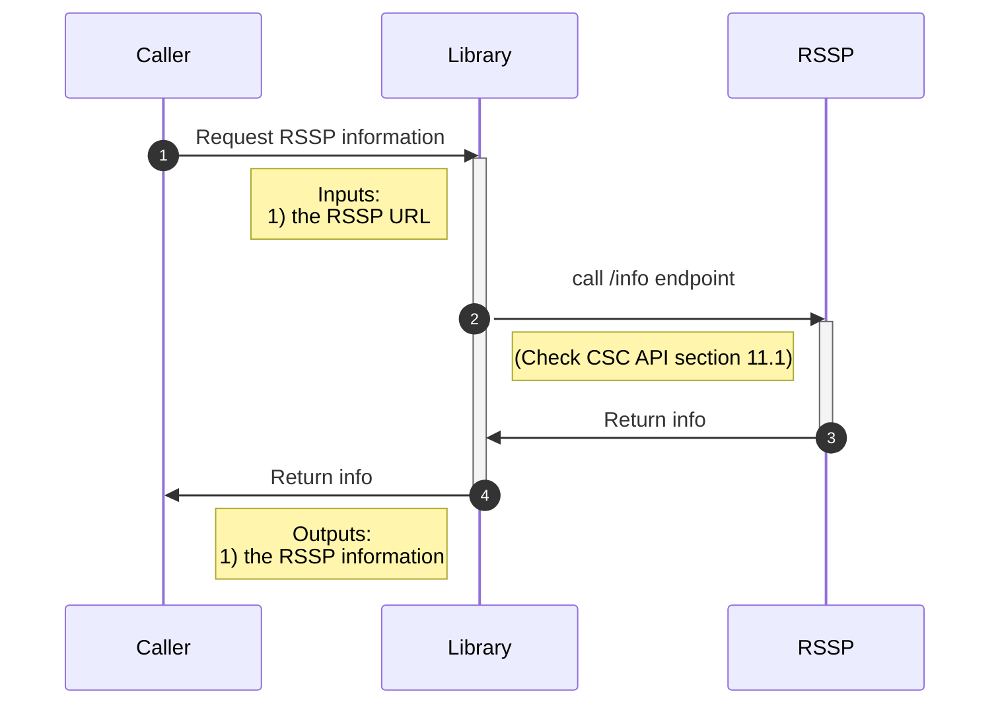
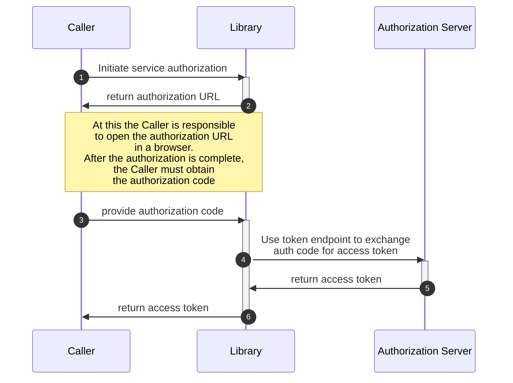
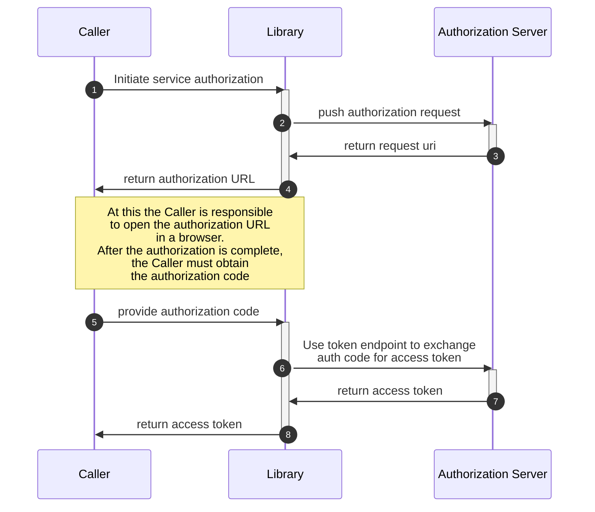
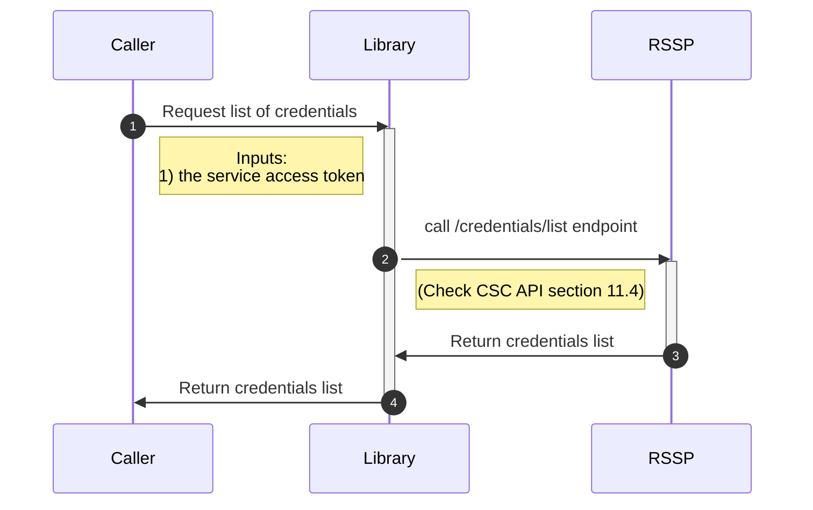
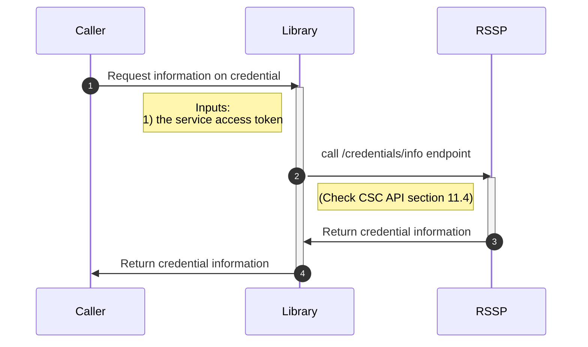
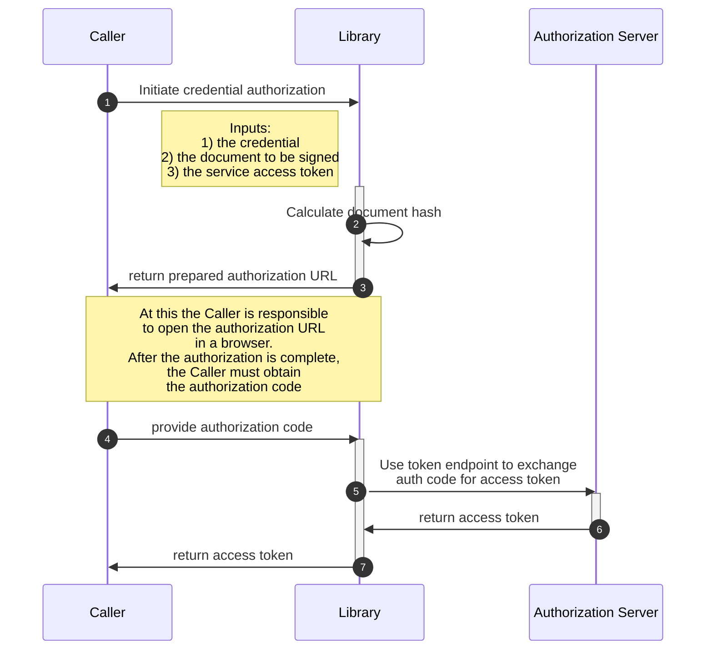
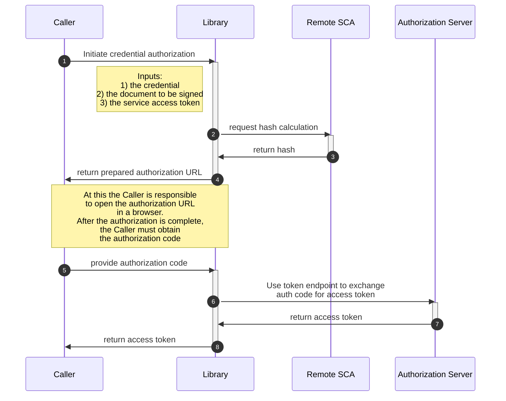
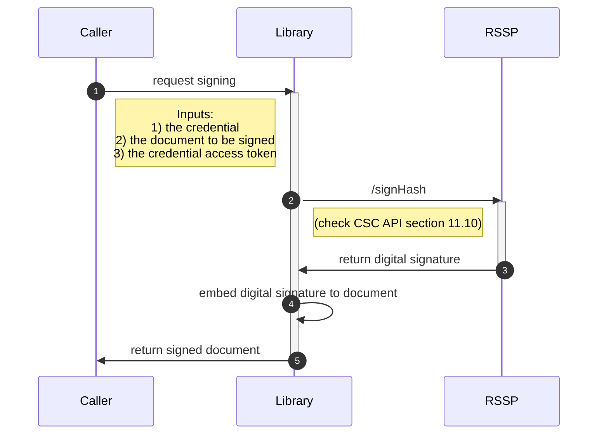

# EUDI rQES CSC library

:heavy_exclamation_mark: **Important!** Before you proceed, please read
the [EUDI Wallet Reference Implementation project description](https://github.com/eu-digital-identity-wallet/.github/blob/main/profile/reference-implementation.md)

[](https://www.apache.org/licenses/LICENSE-2.0)

## Table of contents

* [Overview](#overview)
* [Disclaimer](#disclaimer)
* [Use cases supported](#use-cases-supported)
   1. [Getting Started (UPDATED 29/10/2024)](#getting-started-updated-29102024)
   2. [Info Service](#info-service)
   3. [OAuth2 Authorization Service](#oauth2-authorization-service)
   4. [OAuth2 Token Service](#oauth2-token-service)
   5. [OAuth2 Pushed Authorization Service](#oauth2-pushed-authorization-service)
   6. [Credentials List Service](#credentials-list-service)
   7. [Credentials Info Service](#credentials-info-service)
   8. [Credentials Authorize Service](#credentials-authorize-service)
   9. [Sign Hash Service](#sign-hash-service)
   10. [Sign Document Service](#sign-document-service)
* [Configuration options](#configuration-options)
* [Other features](#other-features)
* [Features not supported](#features-not-supported)
* [How to contribute](#how-to-contribute)
* [License](#license)


## Overview

This is a Swift library, targeting JVM, that supports the [Cloud Signature Consortium API (version 2)](https://cloudsignatureconsortium.org/wp-content/uploads/2023/04/csc-api-v2.0.0.2.pdf) protocol.

## Interactions between the library, the caller and the RSSP

#### Legend

|            |                                                                                     |
| ---------- | ----------------------------------------------------------------------------------- |
| Caller     | The application that is using the library to interact with the RSSP                 |
| Lib        | This library                                                                        |
| RSSP       | The Remote Signing Service Provider                                                 |
| Remote SCA | A remote component that is responsible for hash calculation and signature embedding |

### Get RSSP information



### Service authorization

#### Authorization Code flow



#### Authorization Code flow with Pushed Authorization Requests (PAR)



### Credentials list




### Credentials info




### Credential Authorization flow



### Credential Authorization flow with remote SCA



### Document signing



## Disclaimer

The released software is an initial development release version:
-  The initial development release is an early endeavor reflecting the efforts of a short timeboxed period, and by no means can be considered as the final product.
-  The initial development release may be changed substantially over time, might introduce new features but also may change or remove existing ones, potentially breaking compatibility with your existing code.
-  The initial development release is limited in functional scope.
-  The initial development release may contain errors or design flaws and other problems that could cause system or other failures and data loss.
-  The initial development release has reduced security, privacy, availability, and reliability standards relative to future releases. This could make the software slower, less reliable, or more vulnerable to attacks than mature software.
-  The initial development release is not yet comprehensively documented.
-  Users of the software must perform sufficient engineering and additional testing in order to properly evaluate their application and determine whether any of the open-sourced components is suitable for use in that application.
-  We strongly recommend to not put this version of the software into production use.
-  Only the latest version of the software will be supported


# Use cases supported

## Getting Started (UPDATED 29/10/2024)

To begin using this library, you'll need to initialize the main service object RQES(), which allows access to all the functionality required for interacting with the remote signing services. This service should be instantiated at the start of your application lifecycle and will store essential configuration details like OAuth2 provider links and other metadata retrieved from the info service.

#### **Code Example (Walkthrough: Initializing RQES to Calculating Hash):**

To observe the full functionality of the RQES library, including calculating document hashes, you can run the **RQESFlowTest**


#### Step 1: Initialize the RQES Service

``` swift
// STEP 1: Initialize an instance of RQES to access library services
// This initializes the RQES object for invoking various service methods
let rqes = await RQES()

// STEP 2: Retrieve service information using the InfoService
let response = try await rqes.getInfo(request: request)
JSONUtils.prettyPrintResponseAsJSON(response, message: "InfoService Response:")

// STEP 3: Create a login request with test credentials
let loginRequest = LoginRequest(username: "8PfCAQzTmON+FHDvH4GW/g+JUtg5eVTgtqMKZFdB/+c=;FirstName;TesterUser",
                                password: "5adUg@35Lk_Wrm3")

// STEP 4: Perform the login operation and capture the response
let loginResponse = try await rqes.login(request: loginRequest)
JSONUtils.prettyPrintResponseAsJSON(loginResponse, message: "Login Response:")

// STEP 5: Set up an authorization request using OAuth2AuthorizeRequest with required parameters
let authorizeRequest = OAuth2AuthorizeRequest(
    responseType: "code",
    clientId: "wallet-client",
    redirectUri: "https://walletcentric.signer.eudiw.dev/tester/oauth/login/code",
    scope: "service",
    codeChallenge: "V4n5D1_bu7BPMXWsTulFVkC4ASFmeS7lHXSqIf-vUwI",
    codeChallengeMethod: "S256",
    state: "erv8utb5uie",
    credentialID: nil,
    signatureQualifier: nil,
    numSignatures: nil,
    hashes: nil,
    hashAlgorithmOID: nil,
    authorizationDetails: nil,
    requestUri: nil,
    cookie: loginResponse.cookie!
)

let authorizeResponse = try await rqes.getAuthorizeUrl(request: authorizeRequest)
JSONUtils.prettyPrintResponseAsJSON(authorizeResponse, message: "Authorize Response:")

// STEP 6: Request an OAuth2 Token using the authorization code

let tokenRequest = OAuth2TokenRequest(
    clientId: "wallet-client-tester",
    redirectUri: "https://walletcentric.signer.eudiw.dev/tester/oauth/login/code",
    grantType: "authorization_code",
    codeVerifier: "z34oHaauNSc13ScLRDmbQrJ5bIR9IDzRCWZTRRAPtlV",
    code: authorizeResponse.code,
    state:"erv8utb5uie",
    auth: OAuth2TokenRequest.BasicAuth(
        username: "wallet-client",
        password: "somesecret2"
    )
)

let tokenResponse = try await rqes.getOAuth2Token(request: tokenRequest)
JSONUtils.prettyPrintResponseAsJSON(tokenResponse, message: "Token Response:")  

// STEP 7: Request the list of credentials using the access token

let credentialListRequest = CSCCredentialsListRequest(
    credentialInfo: true,
    certificates: "chain",
    certInfo: true
)

let credentialListResponse = try await rqes.getCredentialsList(request: credentialListRequest, accessToken: tokenResponse.accessToken)
JSONUtils.prettyPrintResponseAsJSON(credentialListResponse, message: "Credential List Response:")

// STEP 8: Request the list of credentials using the access token

let credentialInfoRequest = CSCCredentialsInfoRequest(
    credentialID: credentialListResponse.credentialIDs[0],
    credentialInfo: true,
    certificates: "chain",
    certInfo: true
)

let credentialInfoResponse = try await rqes.getCredentialsInfo(request: credentialInfoRequest, accessToken: tokenResponse.accessToken)
JSONUtils.prettyPrintResponseAsJSON(credentialInfoResponse, message: "Credential Info Response:")

// STEP 9: Request the list of credentials using the access token

let calculateHashRequest = CalculateHashRequest(
    documents: [
        CalculateHashRequest.Document(
            document: encodedPdfExample,
            signatureFormat: "P",
            conformanceLevel: "Ades-B-B",
            signedEnvelopeProperty: "ENVELOPED",
            container: "No"
        )
    ],
    endEntityCertificate: (credentialInfoResponse.cert?.certificates?[0])!,
    certificateChain: [(credentialInfoResponse.cert?.certificates?[1])!],
    hashAlgorithmOID: "1.2.840.113549.1.1.11"
)

let calculateHashResponse = try await rqes.calculateHash(request: calculateHashRequest, accessToken: tokenResponse.accessToken)
JSONUtils.prettyPrintResponseAsJSON(calculateHashResponse, message: "Calculate Hash Response:")

```


## Info Service

<em>Based on 11.1 info</em>

The **InfoService** provides details about the remote service, including supported operations, authorization mechanisms, and service details. It is essential for discovering the capabilities of the remote service.

#### Description

This use case retrieves basic information from the remote service, such as the version, supported methods, and other key data points. It allows the caller to understand the API's capabilities.

- **Input:** `lang` (optional)
- **Output:** Service specifications, supported methods, and other metadata.

#### ***Note for Developers:***
*Once the library successfully instantiates and retrieves the info data, it will automatically store the "oauth2" provider link, making it available for all subsequent calls.*

#### **Input Request:**
``` swift
let request = InfoServiceRequest(lang: "en-US")
```

#### **Example:**
``` swift
let rqes = await RQES()
let response = try await rqes.getInfo(request: request)
```

#### **Expected Response:**
``` json
{
  "specs": "2.0.0.0",
  "name": "ACME Trust Services",
  "logo": "https://service.domain.org/images/logo.png",
  "region": "En",
  "lang": "en-US",
  "description": "An efficient remote signature service",
  "authType": ["basic", "oauth2code"],
  "oauth2": "https://www.domain.org/",
  "methods": [
    "auth/login",
    "auth/revoke",
    "credentials/list",
    "credentials/info",
    "credentials/authorize",
    "credentials/sendOTP",
    "signatures/signHash"
  ],
  "signAlgorithms": {
    "algos": ["1.2.840.10045.4.3.2", "1.2.840.113549.1.1.1", "1.2.840.113549.1.1.10"]
  },
  "signature_formats": {
    "formats": ["C", "X", "P"],
    "envelope_properties": [
      ["Detached", "Attached", "Parallel"],
      ["Enveloped", "Enveloping", "Detached"],
      ["Certification", "Revision"]
    ]
  },
  "conformance_levels": ["Ades-B-B", "Ades-B-T"]
}
```
---
## OAuth2 Authorization Service
<em>Based on 8.4.2 oauth2/authorize</em>

#### Description
The caller initiates an authorization request for either service or credential authorization. The response is a redirection to the specified redirect URI with an authorization code.


### **Input Parameters:**

- **`response_type`** (required): Must be `"code"`. This defines the type of authorization request.
- **`client_id`** (required): The client identifier for the authorization request.
- **`redirect_uri`** (required, conditional): The URL to which the user will be redirected after the authorization process is complete. If omitted, the pre-registered default redirect URI will be used.
- **`scope`** (optional): The scope of the access request. It can be either `"service"` for service authorization or `"credential"` for credential authorization.
- **`code_challenge`** (required): A cryptographic nonce used to bind the authorization request to a specific user agent, preventing replay attacks.
- **`state`, `lang`, `credentialID`, `signatureQualifier`, `numSignatures`, `hashes`** (optional): Additional parameters for customizing the authorization request and handling specific transaction details such as credentials or multi-signature processes.

---


### **OAuth 2.0 Authorization Code Flow**

This example demonstrates how to initiate an authorization request and handle the response using the library.

#### **Input Request:**

```swift
let request = OAuth2AuthorizeRequest(
    responseType: "code",
    clientId: "sca-client",
    redirectUri: "https://walletcentric.signer.eudiw.dev/login/oauth2/code/sca-client",
    scope: "service",
    codeChallenge: "some_nonce_2",
    codeChallengeMethod: "S256",
    state: "12345678",
    credentialID: "65",
    signatureQualifier: nil,
    numSignatures: nil,
    hashes: nil,
    hashAlgorithmOID: nil,
    authorizationDetails: nil,
    requestUri: nil
)
```

#### **Example:**
```swift
let rqes = await RQES()
try await rqes.getInfo()  // if not already done
let response = try await rqes.getAuthorizeUrl(request: request)
```

#### **Expected Response::**
``` json
{
  "url": "https://your_callback_url?code=HS9naJKWwp901hBcK348IUHiuH8374&state=12345678"
}
```

---

## OAuth2 Token Service
<em>Based on 8.4.4 oauth2/token</em>

The **OAuth2TokenService** retrieves an OAuth 2.0 access token using the authorization code grant type. This service allows the client to exchange an authorization code for an access token that can be used to authenticate API requests.

#### **Description**

This use case retrieves an access token for use in further requests. The token is granted by the authorization server in exchange for an authorization code.

- **Input:** OAuth2TokenRequest
  - `grant_type` (required): The grant type (e.g., `authorization_code`).
  - `client_id` (required): The client identifier issued to the application.
  - `client_secret` (required): The client secret for authentication.
  - `code` (required): The authorization code obtained from the authorization server.
  - `redirect_uri` (required): The URL the user was redirected to after authorization.

- **Output:** An OAuth 2.0 access token and other metadata.

#### ***Note for Developers:***
*Once the library successfully exchanges the authorization code for a token, the token will be used in subsequent API requests for authentication.*

#### **Input Request:**
```swift
let request = OAuth2TokenRequest(
    grantType: "authorization_code",
    clientId: "your_client_id",
    clientSecret: "your_client_secret",
    code: "FhxXf9P269L8g",
    redirectUri: "https://myclient.com/callback"
)
```

#### **Example:**
```swift
let rqes = await RQES()
try await rqes.getInfo() // if not already done
let response = try await rqes.getOAuth2Token(request: request)
```

#### **Expected Response:**

``` json
{
  "access_token": "ya29.a0AfH6SMBEp5g2IAXq26IXIU_h6iu9uOX_MzGReak1Y2NkFs3hdZkFxX",
  "token_type": "Bearer",
  "expires_in": 3600,
  "refresh_token": "1//09g8r_sjfNEEeCgYIA"
}
```

---

## OAuth2 Pushed Authorization Service
<em>Based on 8.4.3 oauth2/pushed_authorize</em>

The **OAuth2PushedAuthorizeService** allows the client to securely send authorization requests by pushing the request payload to the authorization server before requesting the user's authorization.

#### **Description**

This use case pushes an authorization request to the authorization server and returns a request URI that can be used to redirect the user for authorization. The pushed authorization allows for detailed credential and document information to be passed within a JSON object.

- **Input:** CSCCredentialsPushedAuthorizeRequest
  - `client_id` (required): The client identifier for the authorization request.
  - `response_type` (required): The response type (e.g., `code`).
  - `redirect_uri` (required): The URL where the user will be redirected after authorization.
  - `scope` (optional): The scope of access (e.g., `service` or `credential`).
  - `code_challenge` (required): Cryptographic nonce to bind the transaction.
  - `code_challenge_method` (optional): Method used to transform the code verifier (defaults to "plain", but "S256" is recommended).
  - `authorization_details` (required): JSON object detailing the authorization request (credentialID, documentDigests, etc.).

- **Output:** A redirection with an authorization code or an error description in case of failure.

#### ***Note for Developers:***
*The pushed authorization request allows you to pass detailed transaction information, such as document hashes and the number of signatures required, in a secure manner.*

#### **Input Request:**
```swift
let request = CSCCredentialsPushedAuthorizeRequest(
    clientId: "example_client_id",
    responseType: "code",
    redirectUri: "https://www.example.com/callback",
    scope: "service",
    codeChallenge: "K2-ltc83acc4h0c9w6ESC_rEMTJ3bww-uCHaoeK1t8U",
    codeChallengeMethod: "S256",
    authorizationDetails: AuthorizationDetails(
        credentialID: "GX0112348",
        signatureQualifier: "eu_eidas_qes",
        documentDigests: [
            PushedAuthorizedDocumentDigest(hash: "sTOgwOm+474gFj0q0x1iSNspKqbcse4IeiqlDg/HWuI=", label: "Example Contract"),
            PushedAuthorizedDocumentDigest(hash: "HZQzZmMAIWekfGH0/ZKW1nsdt0xg3H6bZYztgsMTLw0=", label: "Example Terms of Service")
        ],
        hashAlgorithmOID: "2.16.840.1.101.3.4.2.1"
    ),
    state: "12345678"
)
```

#### **Example:**

```swift
let accessToken = "4/CKN69L8gdSYp5_pwH3XlFQZ3ndFhkXf9P2_TiHRG-bA"

let rqes = await RQES()
try await rqes.getInfo()
let response = try await rqes.pushedAuthorize(request: request, accessToken: accessToken)
JSONUtils.prettyPrintResponseAsJSON(response)
```

#### **Expected Response:**
``` json
{
  "url": "https://your_callback_url?code=HS9naJKWwp901hBcK348IUHiuH8374&state=12345678"
}
```
---


## Credentials List Service
<em>Based on 11.4 credentials/list</em>

The **CredentialsListService** allows the retrieval of a list of credentials associated with a user identifier. This use case also supports returning signing certificates, certificate chains, and additional information about the signing certificate and authorization mechanisms.

#### **Description**
This use case retrieves the list of credentials, which may include multiple credentials associated with a single user or specific credentials for a user in a community. It also provides the option to return detailed certificate information.


- **Input:**
  - `userID` (required, conditional): The identifier for the credential owner.
  - `credentialInfo` (optional): Whether to return certificate information (default: false).
  - `certificates` (optional, conditional): Specifies the certificates to return, such as "none", "single", or "chain".
  - `certInfo` (optional, conditional): Whether to return information from the certificate (default: false).
  - `authInfo` (optional, conditional): Whether to return authorization mechanisms (default: false).
  - `onlyValid` (optional, conditional): Whether to return only valid credentials (default: false).
  - `lang` (optional): Language for the response.
  - `clientData` (optional): Custom client data for debugging.

- **Output:** 
  A list of credentials associated with the user, including certificate details, authorization mechanisms, and status of the credentials.

#### **Input Request:**
```swift
let request = CSCCredentialsListRequest(
    credentialInfo: true,
    certificates: "chain",
    certInfo: true,
    authInfo: true
)
```

#### **Example:**
```swift
let accessToken = "4/CKN69L8gdSYp5_pwH3XlFQZ3ndFhkXf9P2_TiHRG-bA"

let rqes = await RQES()
try await rqes.getInfo() // if not already done

let response = try await rqes.getCredentialsList(request: request, accessToken: accessToken)
```

#### **Expected Response:**
``` json
{
  "credentialIDs": [ "GX0112348", "HX0224685" ],
  "credentialInfos": [
    {
      "credentialID": "GX0112348",
      "key": {
        "status": "enabled",
        "algo": [ "1.2.840.113549.1.1.11", "1.2.840.113549.1.1.10" ],
        "len": 2048
      },
      "cert": {
        "status": "valid",
        "certificates": [
          "<Base64-encoded_X.509_end_entity_certificate>",
          "<Base64-encoded_X.509_intermediate_CA_certificate>",
          "<Base64-encoded_X.509_root_CA_certificate>"
        ],
        "issuerDN": "<X.500_issuer_DN_printable_string>",
        "serialNumber": "5AAC41CD8FA22B953640",
        "subjectDN": "<X.500_subject_DN_printable_string>",
        "validFrom": "20200101100000Z",
        "validTo": "20230101095959Z"
      },
      "auth": {
        "mode": "explicit",
        "expression": "PIN AND OTP",
        "objects": [
          {
            "type": "Password",
            "id": "PIN",
            "format": "N",
            "label": "PIN",
            "description": "Please enter the signature PIN"
          },
          {
            "type": "Password",
            "id": "OTP",
            "format": "N",
            "generator": "totp",
            "label": "Mobile OTP",
            "description": "Please enter the 6 digit code you received by SMS"
          }
        ]
      },
      "multisign": 5,
      "lang": "en-US"
    },
    {
      "credentialID": "HX0224685"
      // Additional credential details...
    }
  ]
}
```


## Credentials Info Service
<em>Based on 11.5 credentials/info</em>

#### Description
This use case retrieves information about a credential, including its certificate, authorization mechanisms, and key details. It can return full details of the certificate chain or just the end entity certificate, as well as various status attributes.

- **Input:**
  - `credentialID` (required): The unique identifier of the credential.
  - `certificates` (optional): Whether to return no certificate (`none`), only the end entity certificate (`single`), or the entire chain (`chain`).
  - `certInfo` (optional): Whether to return details from the certificate (default: false).
  - `authInfo` (optional): Whether to return information on authorization mechanisms (default: false).
  - `lang` (optional): The language for the response.
  - `clientData` (optional): Additional data for debugging or other purposes.

- **Output:** 
  The credential details including the signing key, certificate status, authorization methods, and more.

#### **Input Request:**
```swift
let request = CSCCredentialsInfoRequest(
    credentialID: "GX0112348",
    certificates: "chain",
    certInfo: true,
    authInfo: true
)
```

#### **Example:**
``` swift
let accessToken = "4/CKN69L8gdSYp5_pwH3XlFQZ3ndFhkXf9P2_TiHRG-bA"

let rqes = await RQES()
try await rqes.getInfo() // if not already done
let response = try await rqes.getCredentialsInfo(request: request, accessToken: accessToken)
```

#### **Expected Response:**

``` json
{
  "key": {
    "status": "enabled",
    "algo": [
      "1.2.840.113549.1.1.1",
      "0.4.0.127.0.7.1.1.4.1.3"
    ],
    "len": 2048
  },
  "cert": {
    "status": "valid",
    "certificates": [
      "<Base64-encoded_X.509_end_entity_certificate>",
      "<Base64-encoded_X.509_intermediate_CA_certificate>",
      "<Base64-encoded_X.509_root_CA_certificate>"
    ],
    "issuerDN": "<X.500_issuer_DN_printable_string>",
    "serialNumber": "5AAC41CD8FA22B953640",
    "subjectDN": "<X.500_subject_DN_printable_string>",
    "validFrom": "20180101100000Z",
    "validTo": "20190101095959Z"
  },
  "auth": {
    "mode": "explicit",
    "expression": "PIN AND OTP",
    "objects": [
      {
        "type": "Password",
        "id": "PIN",
        "format": "N",
        "label": "PIN",
        "description": "Please enter the signature PIN"
      },
      {
        "type": "Password",
        "id": "OTP",
        "format": "N",
        "generator": "totp",
        "label": "Mobile OTP",
        "description": "Please enter the 6 digit code you received by SMS"
      }
    ]
  },
  "multisign": 5,
  "lang": "en-US"
}

```

## Credentials Authorize Service
<em>Based on 11.6 credentials/authorize</em>

#### Description
This use case authorizes the use of a specific credential for remote signing. It returns the SAD needed for the `signatures/signHash` or `signatures/signDoc` methods, based on the credentials authorization mechanism.

- **Input:**
  - `credentialID` (required): The credential ID for authorization.
  - `numSignatures` (required): The number of signatures to authorize.
  - `hashes` (required, conditional): The hashes to be signed, encoded in base64.
  - `hashAlgorithmOID` (required, conditional): The OID of the hash algorithm used.
  - `authData` (required, conditional): The authentication objects collected from the user.
  - `description` (optional): A description of the authorization transaction.
  - `clientData` (optional): Additional client-specific data.

- **Output:**
  - The Signature Activation Data (SAD) to be used in subsequent signing operations.

#### **Input Request:**
```swift
let request = CSCCredentialsAuthorizeRequest(
    credentialID: "GX0112348",
    numSignatures: 2,
    hashes: [
        "sTOgwOm+474gFj0q0x1iSNspKqbcse4IeiqlDg/HWuI=",
        "c1RPZ3dPbSs0NzRnRmowcTB4MWlTTnNwS3FiY3NlNEllaXFsRGcvSFd1ST0="
    ],
    hashAlgorithmOID: "2.16.840.1.101.3.4.2.1",
    authData: [
        AuthData(id: "PIN", value: "123456"),
        AuthData(id: "OTP", value: "738496")
    ],
    description: "Authorization for signing PDF",
    clientData: "12345678"
)
```

#### **Example:**
```swift
let accessToken = "4/CKN69L8gdSYp5_pwH3XlFQZ3ndFhkXf9P2_TiHRG-bA"

let rqes = await RQES()
try await rqes.getInfo() // if not already done
let response = try await rqes.authorizeCredentials(request: request, accessToken: accessToken)
```

#### **Expected Response:**
``` json
{
  "SAD": "_TiHRG-bAH3XlFQZ3ndFhkXf9P24/CKN69L8gdSYp5_pw"
}
```

## Sign Hash Service
<em>Based on 11.10 signatures/signHash</em>

#### Description
This use case calculates the digital signature for a set of hashes. The signing application must provide the Signature Activation Data (SAD) obtained from the credential authorization and the access token with the appropriate scope.


- **Input:**
  - `credentialID` (required): The credential ID to use for signing.
  - `SAD` (required, conditional): The Signature Activation Data (SAD) for the transaction.
  - `hashes` (required): One or more Base64-encoded hash values to be signed.
  - `hashAlgorithmOID` (required, conditional): The OID of the hash algorithm used.
  - `signAlgo` (required): The signature algorithm OID to use for signing.
  - `clientData` (optional): Additional client-specific data.
  - `operationMode` (optional): The operation mode (`"A"` for asynchronous, `"S"` for synchronous). Defaults to `"S"` if not provided.

- **Output:**
  - The signed hashes in the same order as the input.
  - An asynchronous operation may return a `responseID` to retrieve the outcome later.

#### **Input Request:**
```swift
let request = SignHashRequest(
    credentialID: "GX0112348",
    SAD: "_TiHRG-bAH3XlFQZ3ndFhkXf9P24/CKN69L8gdSYp5_pw",
    hashes: [
        "sTOgwOm+474gFj0q0x1iSNspKqbcse4IeiqlDg/HWuI=",
        "c1RPZ3dPbSs0NzRnRmowcTB4MWlTTnNwS3FiY3NlNEllaXFsRGcvSFd1ST0="
    ],
    hashAlgorithmOID: "2.16.840.1.101.3.4.2.1",
    signAlgo: "1.2.840.113549.1.1.1",
    clientData: "12345678"
)
```

#### **Example:**
```swift
let accessToken = "4/CKN69L8gdSYp5_pwH3XlFQZ3ndFhkXf9P2_TiHRG-bA"

let rqes = await RQES()
try await rqes.getInfo() // if not already done

let response = try await rqes.signHash(request: request, accessToken: accessToken)
```

#### **Expected Response:**
``` json
{
  "signatures": [
    "KedJuTob5gtvYx9qM3k3gm7kbLBwVbEQRl26S2tmXjqNND7MRGtoew==",
    "Idhef7xzgtvYx9qM3k3gm7kbLBwVbE98239S2tm8hUh85KKsfdowel=="
  ]
}
```


## Sign Document Service
<em>Based on 11.11 signatures/signDoc</em>

#### Description
This method creates an AdES signature for each provided document or document digest. The application must specify the signing credential or signature qualifier and provide the Signature Activation Data (SAD) from the credential authorization.

- **Input:**
  - `credentialID` (required, conditional): The credential ID used for signing.
  - `signatureQualifier` (required, conditional): Identifier of the type of signature to be created, such as `"eu_eidas_qes"`.
  - `SAD` (required, conditional): The Signature Activation Data for the transaction.
  - `documentDigests` (required, conditional): A JSON array of hashes of the documents to be signed.
  - `documents` (required, conditional): A JSON array of base64-encoded documents to be signed.
  - `operationMode` (optional): Asynchronous or synchronous operation mode (`"A"` or `"S"`). Defaults to synchronous.
  - `clientData` (optional): Additional client-specific data.
  - `returnValidationInfo` (optional): Set to `true` to request validation info in the response.

- **Output:**
  - Returns the signed documents or signatures as Base64-encoded strings.
  - May include validation information if requested.

#### **Input Request Example:**
```swift
let request = SignDocRequest(
    credentialID: "GX0112348",
    SAD: "_TiHRG-bAH3XlFQZ3ndFhkXf9P24/CKN69L8gdSYp5_pw",
    documentDigests: [
        DocumentDigest(
            hashes: ["sTOgwOm+474gFj0q0x1iSNspKqbcse4IeiqlDg/HWuI=", "HZQzZmMAIWekfGH0/ZKW1nsdt0xg3H6bZYztgsMTLw0="],
            hashAlgorithmOID: "2.16.840.1.101.3.4.2.1",
            signatureFormat: "P",
            conformanceLevel: "AdES-B-T",
            signAlgo: "1.2.840.113549.1.1.1"
        )
    ],
    documents: [
        Document(
            document: "Q2VydGlmaWNhdGVTZXJpYWxOdW1iZ…KzBTWWVJWWZZVXptU3V5MVU9DQo=",
            signatureFormat: "P",
            conformanceLevel: "AdES-B-T",
            signAlgo: "1.2.840.113549.1.1.1",
            signedEnvelopeProperty: "Attached"
        ),
        Document(
            document: "Q2VydGlmaWNhdGVTZXJpYWxOdW1iZXI7U3…emNNbUNiL1cyQT09DQo=",
            signatureFormat: "C",
            conformanceLevel: "AdES-B-B",
            signAlgo: "1.2.840.113549.1.1.1",
            signedEnvelopeProperty: "Attached"
        )
    ],
    clientData: "12345678",
    returnValidationInfo: true
)
```

#### **Example:**
```swift
let accessToken = "4/CKN69L8gdSYp5_pwH3XlFQZ3ndFhkXf9P2_TiHRG-bA"

let rqes = await RQES()
try await rqes.getInfo() // if not already done
let response = try await rqes.signDoc(request: request, accessToken: accessToken)
```

#### **Expected Response:**
``` json
{
  "DocumentWithSignature": [
    "MILuLgYJKoZIhvcNAQcCoILuHz…ehEeR5ZRi5+WV5T1FpO",
    "MIL4IAYJKoZIhvcNAQcCoIL4…YavvBxkVwJ3dFD9KbCi1qW3TxTI="
  ],
  "SignatureObject": [
    "MIAGCSqAMIACAQExDzANBglghkgBZQMEAgEFADCABgkqhkiG…Ss4rEsQV4AAAAAAAAA==",
    "MIAGCSqGSIb3DQEHAqCAMIACAQExDzANBglghkgBZQMEqhki…W7pP1ZJFKuF2YAAAAAAA"
  ]
}
```


## How to contribute

We welcome contributions to this project. To ensure that the process is smooth for everyone
involved, follow the guidelines found in [CONTRIBUTING.md](CONTRIBUTING.md).

## License

### License details

Copyright (c) 2023 European Commission

Licensed under the Apache License, Version 2.0 (the "License");
you may not use this file except in compliance with the License.
You may obtain a copy of the License at

    http://www.apache.org/licenses/LICENSE-2.0

Unless required by applicable law or agreed to in writing, software
distributed under the License is distributed on an "AS IS" BASIS,
WITHOUT WARRANTIES OR CONDITIONS OF ANY KIND, either express or implied.
See the License for the specific language governing permissions and
limitations under the License.
