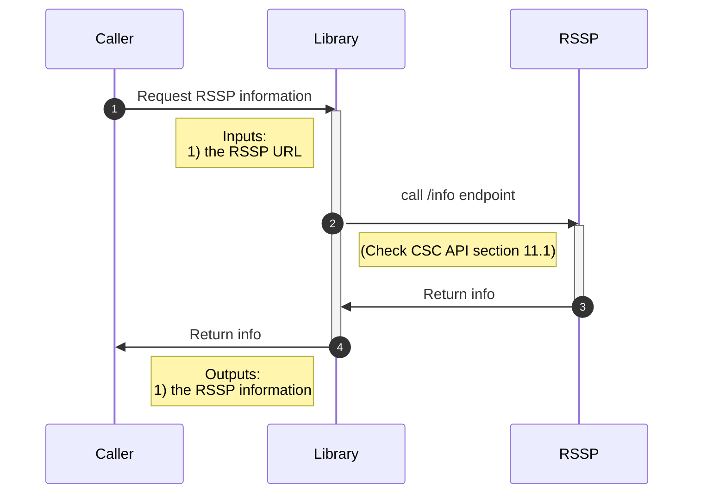
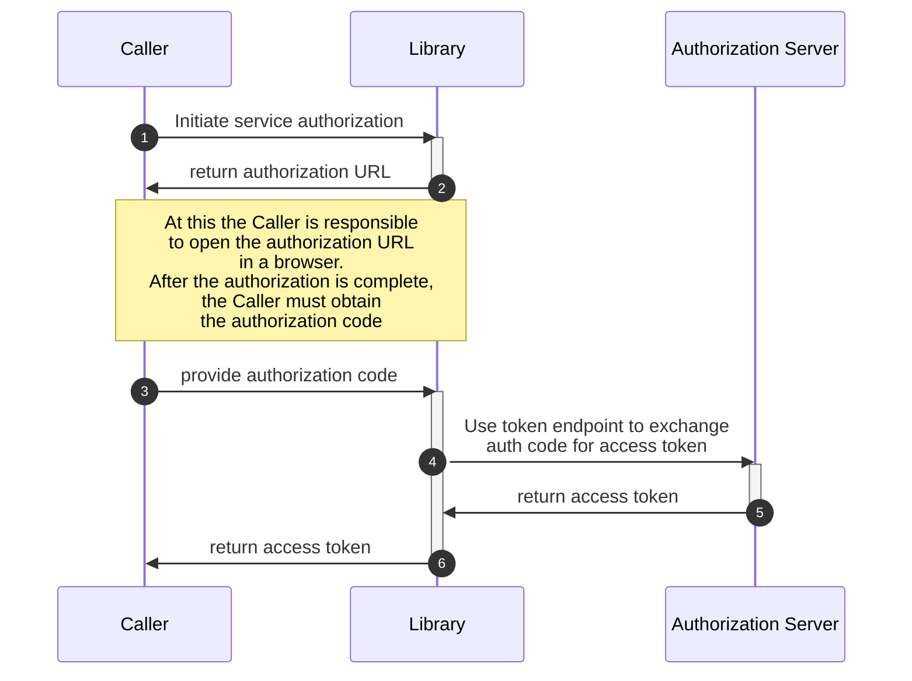
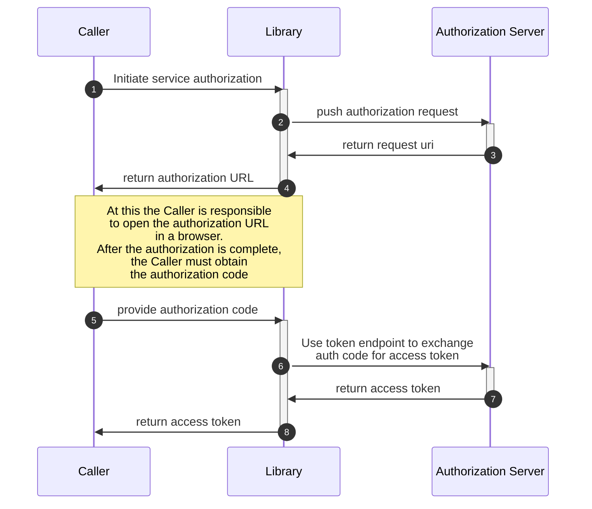
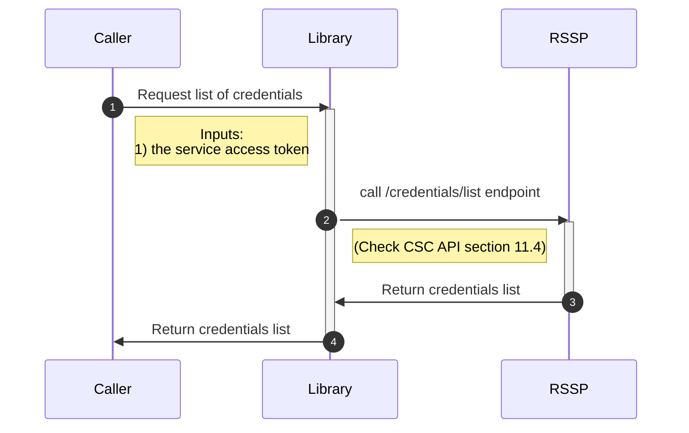
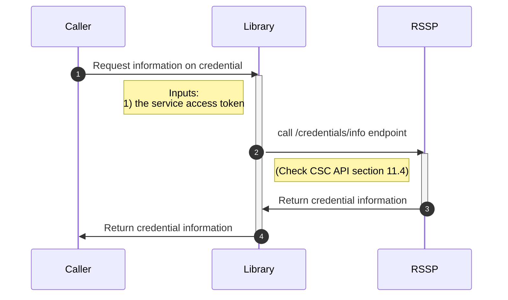
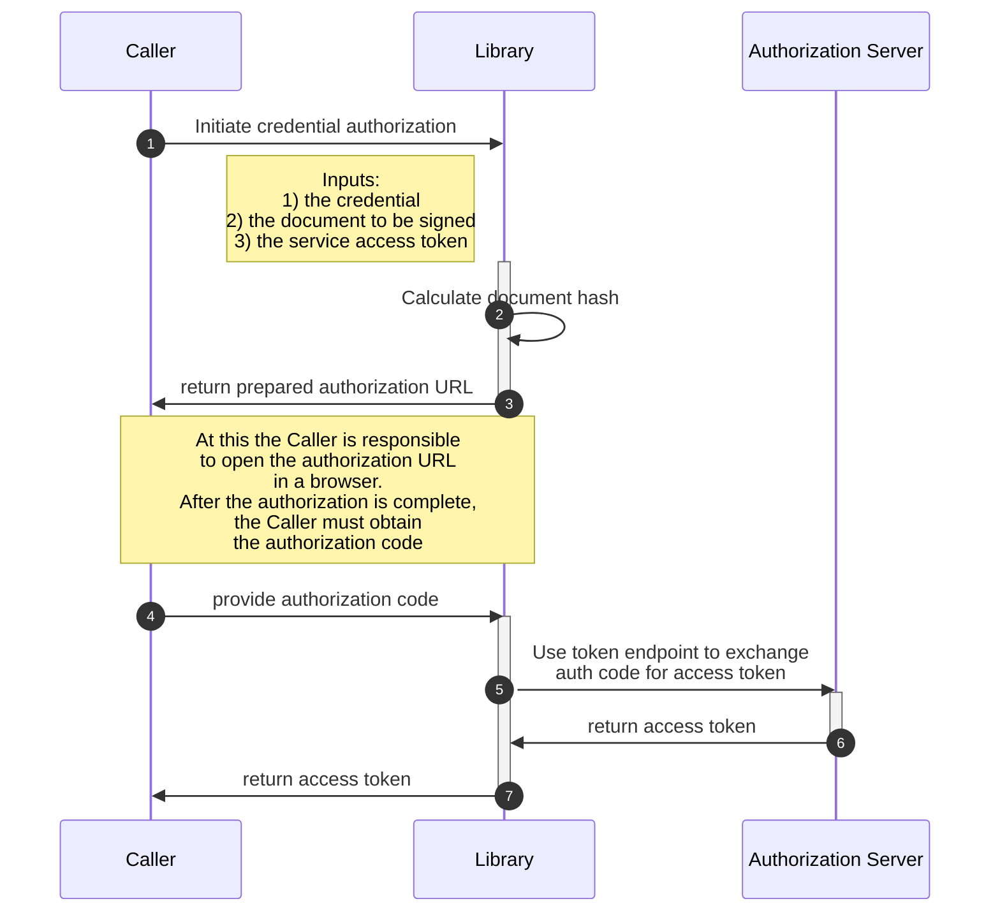
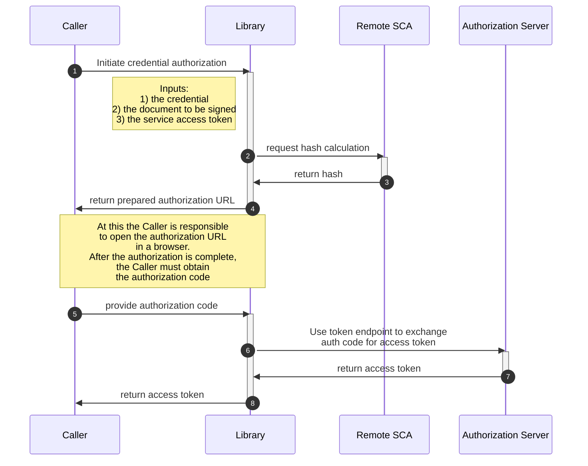
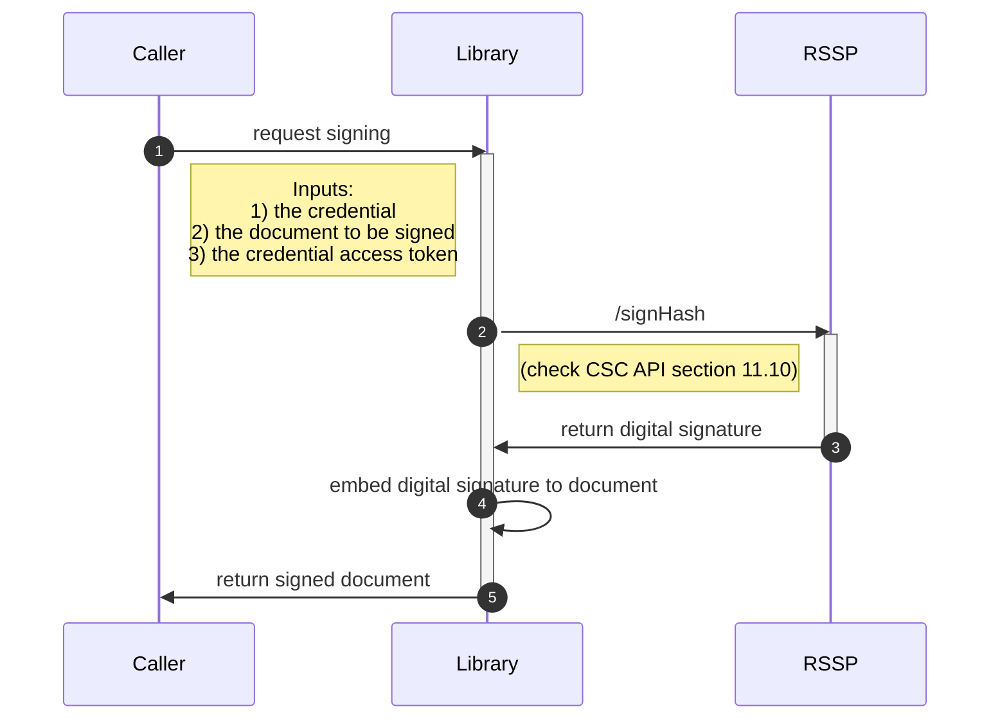

# EUDI rQES CSC library

:heavy_exclamation_mark: **Important!** Before you proceed, please read
the [EUDI Wallet Reference Implementation project description](https://github.com/eu-digital-identity-wallet/.github/blob/main/profile/reference-implementation.md)

[](https://www.apache.org/licenses/LICENSE-2.0)

## Table of contents

* [Overview](#overview)
* [Disclaimer](#disclaimer)
* [Use cases supported](#use-cases-supported)
   1. [Getting Started (UPDATED 05/11/2024)](#getting-started-updated-05112024)
* [Configuration options](#configuration-options)
* [Other features](#other-features)
* [Features not supported](#features-not-supported)
* [How to contribute](#how-to-contribute)
* [License](#license)


## Overview

This is a Swift library, targeting JVM, that supports the [Cloud Signature Consortium API (version 2)](https://cloudsignatureconsortium.org/wp-content/uploads/2023/04/csc-api-v2.0.0.2.pdf) protocol.

## Interactions between the library, the caller and the RSSP

#### Legend

|            |                                                                                     |
| ---------- | ----------------------------------------------------------------------------------- |
| Caller     | The application that is using the library to interact with the RSSP                 |
| Lib        | This library                                                                        |
| RSSP       | The Remote Signing Service Provider                                                 |
| Remote SCA | A remote component that is responsible for hash calculation and signature embedding |

### Get RSSP information



### Service authorization

#### Authorization Code flow



#### Authorization Code flow with Pushed Authorization Requests (PAR)



### Credentials list




### Credentials info




### Credential Authorization flow



### Credential Authorization flow with remote SCA



### Document signing



## Disclaimer

The released software is an initial development release version:
-  The initial development release is an early endeavor reflecting the efforts of a short timeboxed period, and by no means can be considered as the final product.
-  The initial development release may be changed substantially over time, might introduce new features but also may change or remove existing ones, potentially breaking compatibility with your existing code.
-  The initial development release is limited in functional scope.
-  The initial development release may contain errors or design flaws and other problems that could cause system or other failures and data loss.
-  The initial development release has reduced security, privacy, availability, and reliability standards relative to future releases. This could make the software slower, less reliable, or more vulnerable to attacks than mature software.
-  The initial development release is not yet comprehensively documented.
-  Users of the software must perform sufficient engineering and additional testing in order to properly evaluate their application and determine whether any of the open-sourced components is suitable for use in that application.
-  We strongly recommend to not put this version of the software into production use.
-  Only the latest version of the software will be supported


# Use cases supported

## Getting Started (UPDATED 05/11/2024)

To begin using this library, you'll need to initialize the main service object RQES(), which allows access to all the functionality required for interacting with the remote signing services. This service should be instantiated at the start of your application lifecycle and will store essential configuration details like OAuth2 provider links and other metadata retrieved from the info service.

#### **Code Example (Walkthrough: Initializing RQES to Calculating Hash):**

To observe the full functionality of the RQES library, including calculating document hashes, you can run the **RQESFlowExample** under the tests folder. This example demonstrates the following steps:


#### EXAMPLE

``` swift
// STEP 1: Initialize an instance of RQES to access library services
// This initializes the RQES object for invoking various service methods
let rqes = await RQES()

// STEP 2: Retrieve service information using the InfoService
let request = InfoServiceRequest(lang: "en-US")
let response = try await rqes.getInfo(request: request)
JSONUtils.prettyPrintResponseAsJSON(response, message: "InfoService Response:")

// STEP 3: Create a login request with test credentials
let loginRequest = LoginRequest(username: "8PfCAQzTmON+FHDvH4GW/g+JUtg5eVTgtqMKZFdB/+c=;FirstName;TesterUser",
                                password: "5adUg@35Lk_Wrm3")

// STEP 4: Perform the login operation and capture the response
let loginResponse = try await rqes.login(request: loginRequest)
JSONUtils.prettyPrintResponseAsJSON(loginResponse, message: "Login Response:")

// STEP 5: Set up an authorization request using OAuth2AuthorizeRequest with required parameters
let authorizeRequest = OAuth2AuthorizeRequest(
    responseType: "code",
    clientId: "wallet-client",
    redirectUri: "https://walletcentric.signer.eudiw.dev/tester/oauth/login/code",
    scope: Scope.SERVICE, // predefined value or a custom string like "service",
    codeChallenge: "V4n5D1_bu7BPMXWsTulFVkC4ASFmeS7lHXSqIf-vUwI",
    codeChallengeMethod: "S256",
    state: "erv8utb5uie",
    credentialID: nil,
    signatureQualifier: nil,
    numSignatures: nil,
    hashes: nil,
    hashAlgorithmOID: nil,
    authorizationDetails: nil,
    requestUri: nil,
    cookie: loginResponse.cookie!
)

let authorizeResponse = try await rqes.getAuthorizeUrl(request: authorizeRequest)
JSONUtils.prettyPrintResponseAsJSON(authorizeResponse, message: "Authorize Response:")

// STEP 6: Request an OAuth2 Token using the authorization code
let tokenRequest = OAuth2TokenRequest(
    clientId: "wallet-client-tester",
    redirectUri: "https://walletcentric.signer.eudiw.dev/tester/oauth/login/code",
    grantType: "authorization_code",
    codeVerifier: "z34oHaauNSc13ScLRDmbQrJ5bIR9IDzRCWZTRRAPtlV",
    code: authorizeResponse.code,
    state:"erv8utb5uie",
    auth: OAuth2TokenRequest.BasicAuth(
        username: "wallet-client",
        password: "somesecret2"
    )
)

let tokenResponse = try await rqes.getOAuth2Token(request: tokenRequest)
JSONUtils.prettyPrintResponseAsJSON(tokenResponse, message: "Token Response:")

// STEP 7: Request the list of credentials using the access token
let credentialListRequest = CSCCredentialsListRequest(
    credentialInfo: true,
    certificates: "chain",
    certInfo: true
)

let credentialListResponse = try await rqes.getCredentialsList(request: credentialListRequest, accessToken: tokenResponse.accessToken)
JSONUtils.prettyPrintResponseAsJSON(credentialListResponse, message: "Credential List Response:")

// STEP 8: Request the list of credentials using the access token
let credentialInfoRequest = CSCCredentialsInfoRequest(
    credentialID: credentialListResponse.credentialIDs[0],
    credentialInfo: true,
    certificates: "chain",
    certInfo: true
)

let credentialInfoResponse = try await rqes.getCredentialsInfo(request: credentialInfoRequest, accessToken: tokenResponse.accessToken)
JSONUtils.prettyPrintResponseAsJSON(credentialInfoResponse, message: "Credential Info Response:")

// This loads the PDF document from the specified file name within the resources,
// encodes it in Base64 format, and assigns it to the pdfDocument variable for further processing.
let pdfDocument = FileUtils.getBase64EncodedDocument(fileNameWithExtension: "sample 1.pdf")

// STEP 9: Request the list of credentials using the access token
let calculateHashRequest = CalculateHashRequest(
    documents: [
        CalculateHashRequest.Document(
            document: pdfDocument!,
            signatureFormat: SignatureFormat.P, //predefined value or custom string like "P"
            conformanceLevel: ConformanceLevel.ADES_B_B, //predefined value or custom string like "Ades-B-B",
            signedEnvelopeProperty: SignedEnvelopeProperty.ENVELOPED,  //predefined value or custom string like "ENVELOPED",
            container: "No"
        )
    ],
    endEntityCertificate: (credentialInfoResponse.cert?.certificates?[0])!,
    certificateChain: [(credentialInfoResponse.cert?.certificates?[1])!],
    hashAlgorithmOID: HashAlgorithmOID.SHA256 //predefined value or custom string like "2.16.840.1.101.3.4.2.1"
)

let calculateHashResponse = try await rqes.calculateHash(request: calculateHashRequest, accessToken: tokenResponse.accessToken)
JSONUtils.prettyPrintResponseAsJSON(calculateHashResponse, message: "Calculate Hash Response:")

// STEP 10: Set up an credential authorization request using OAuth2AuthorizeRequest with required parameters
let authorizationDetails = AuthorizationDetails([
    AuthorizationDetailsItem(
        documentDigests: [
            DocumentDigest(
                label: "A sample pdf",
                hash: calculateHashResponse.hashes[0]
            )
        ],
        credentialID: credentialListResponse.credentialIDs[0],
        hashAlgorithmOID: HashAlgorithmOID.SHA256, //predefined value or custom string like "2.16.840.1.101.3.4.2.1"
        locations: [],
        type: "credential"
    )
])

let details = JSONUtils.stringify(authorizationDetails)

let authorizeCredentialRequest = OAuth2AuthorizeRequest(
    responseType: "code",
    clientId: "wallet-client",
    redirectUri: "https://walletcentric.signer.eudiw.dev/tester/oauth/login/code",
    scope: Scope.CREDENTIAL, // predefined value or a custom string like "credential",
    codeChallenge: "V4n5D1_bu7BPMXWsTulFVkC4ASFmeS7lHXSqIf-vUwI",
    codeChallengeMethod: "S256",
    state: "erv8utb5uie",
    credentialID: credentialListResponse.credentialIDs[0],
    signatureQualifier: nil,
    numSignatures: nil,
    hashes: nil,
    hashAlgorithmOID: nil,
    authorizationDetails:details!,
    requestUri: nil,
    cookie: loginResponse.cookie!
)

let authorizeCredentialResponse = try await rqes.getAuthorizeUrl(request: authorizeCredentialRequest)
JSONUtils.prettyPrintResponseAsJSON(authorizeCredentialResponse, message: "Authorize Credential Response:")


// STEP 11: Request OAuth2 token for credential authorization
let tokenCredentialRequest = OAuth2TokenRequest(
    clientId: "wallet-client-tester",
    redirectUri: "https://walletcentric.signer.eudiw.dev/tester/oauth/login/code",
    grantType: "authorization_code",
    codeVerifier: "z34oHaauNSc13ScLRDmbQrJ5bIR9IDzRCWZTRRAPtlV",
    code: authorizeCredentialResponse.code,
    state:"erv8utb5uie",
    auth: OAuth2TokenRequest.BasicAuth(
        username: "wallet-client",
        password: "somesecret2"
    ),
    authorizationDetails: details!
)

let tokenCredentialResponse = try await rqes.getOAuth2Token(request: tokenCredentialRequest)
JSONUtils.prettyPrintResponseAsJSON(tokenCredentialResponse, message: "Token Credential Response:")

// STEP 12: Sign the calculated hash with the credential
let signHashRequest =  SignHashRequest(
    credentialID: credentialListResponse.credentialIDs[0],
    hashes: [calculateHashResponse.hashes[0]],
    hashAlgorithmOID: HashAlgorithmOID.SHA256, // predefined value or custom string like "2.16.840.1.101.3.4.2.1"
    signAlgo: SigningAlgorithmOID.RSA, //predefined value or custom string like "1.2.840.113549.1.1.1",
    operationMode: "S"
)

let signHashResponse = try await rqes.signHash(request: signHashRequest, accessToken: tokenCredentialResponse.accessToken)
JSONUtils.prettyPrintResponseAsJSON(signHashResponse, message: "Sign Hash Response:")

// STEP 13: Obtain the signed document
let obtainSignedDocRequest = ObtainSignedDocRequest(
    documents: [
        ObtainSignedDocRequest.Document(
            document: pdfDocument!,
            signatureFormat: SignatureFormat.P, //predefined value or custom string like "P"
            conformanceLevel: ConformanceLevel.ADES_B_B, //predefined value or custom string like "Ades-B-B",
            signedEnvelopeProperty: SignedEnvelopeProperty.ENVELOPED,  //predefined value or custom string like "ENVELOPED",
            container: "No"
        )
    ],
    endEntityCertificate: credentialInfoResponse.cert?.certificates?.first ?? "",
    certificateChain: credentialInfoResponse.cert?.certificates?.dropFirst().map { $0 } ?? [],
    hashAlgorithmOID: HashAlgorithmOID.SHA256, //predefined value or custom string like "2.16.840.1.101.3.4.2.1"
    date: calculateHashResponse.signatureDate,
    signatures: signHashResponse.signatures ?? []
)

let obtainSignedDocResponse = try await rqes.obtainSignedDoc(request: obtainSignedDocRequest, accessToken: tokenCredentialResponse.accessToken)
JSONUtils.prettyPrintResponseAsJSON(obtainSignedDocResponse, message: "Obtain Signed Doc Response:")


let base64String = obtainSignedDocResponse.documentWithSignature[0]

// Save the decoded data to the user's documents folder
FileUtils.decodeAndSaveBase64Document(base64String: base64String, fileNameWithExtension: "signed.pdf")
            


```


## How to contribute

We welcome contributions to this project. To ensure that the process is smooth for everyone
involved, follow the guidelines found in [CONTRIBUTING.md](CONTRIBUTING.md).

## License

### License details

Copyright (c) 2023 European Commission

Licensed under the Apache License, Version 2.0 (the "License");
you may not use this file except in compliance with the License.
You may obtain a copy of the License at

    http://www.apache.org/licenses/LICENSE-2.0

Unless required by applicable law or agreed to in writing, software
distributed under the License is distributed on an "AS IS" BASIS,
WITHOUT WARRANTIES OR CONDITIONS OF ANY KIND, either express or implied.
See the License for the specific language governing permissions and
limitations under the License.
