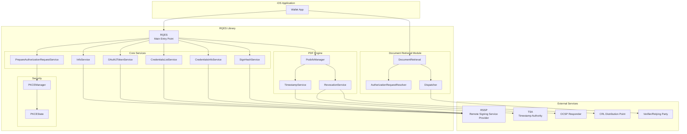
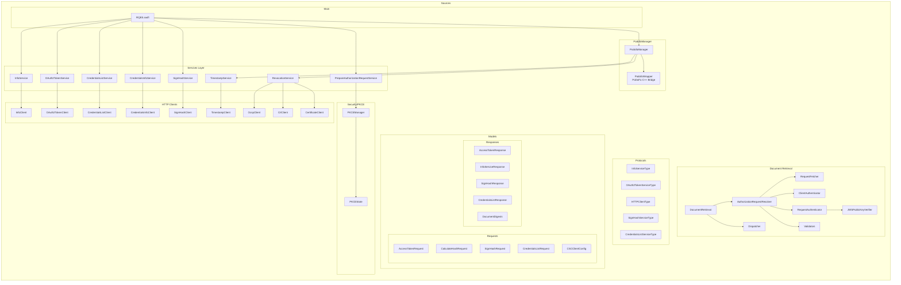
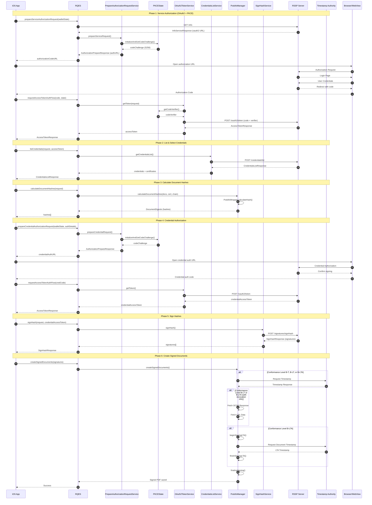
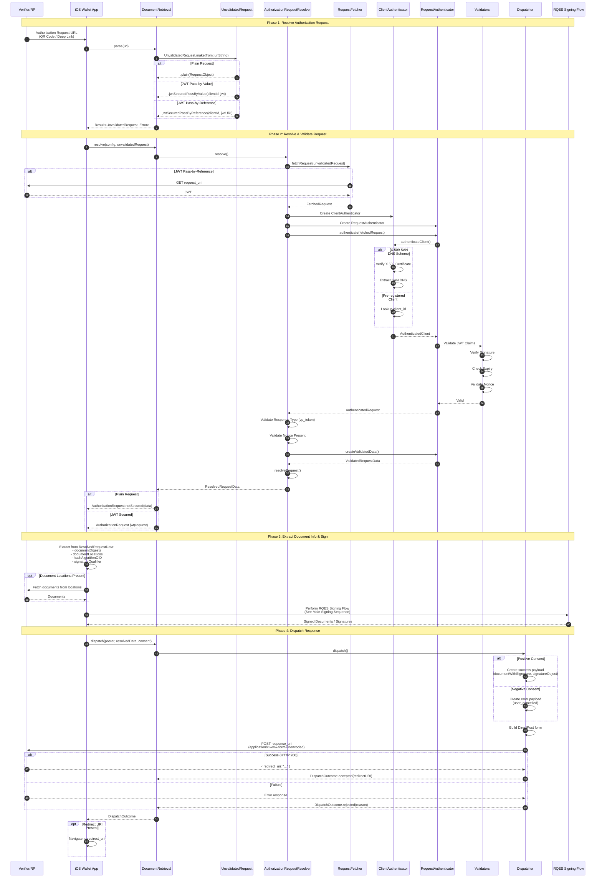
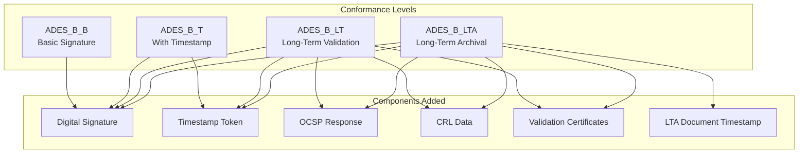
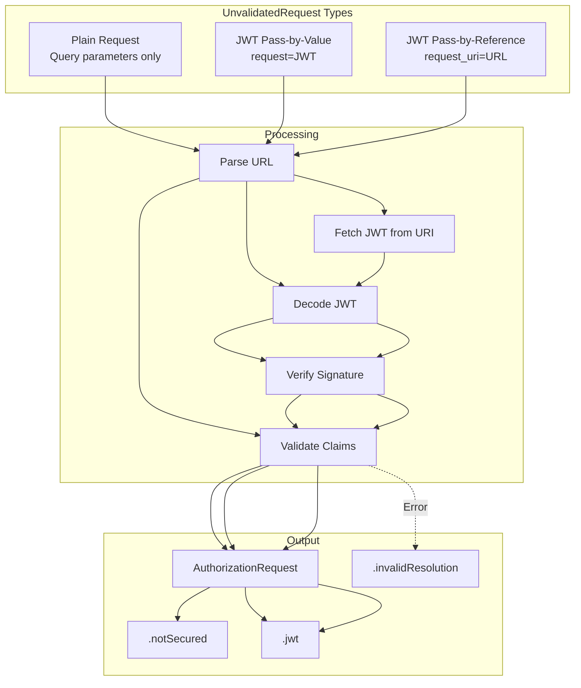
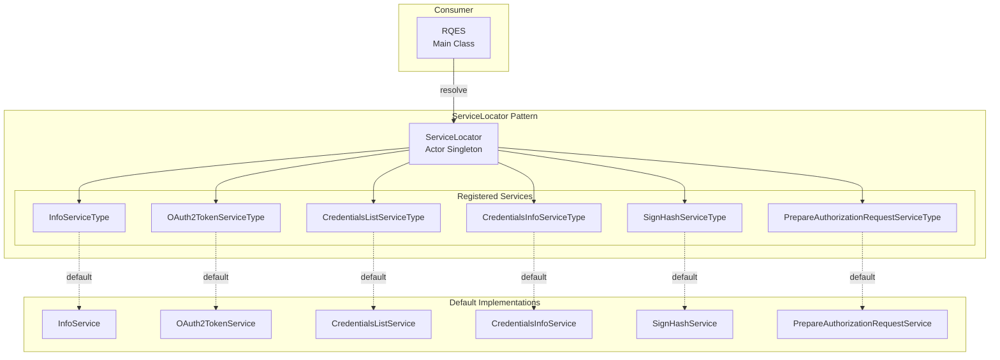
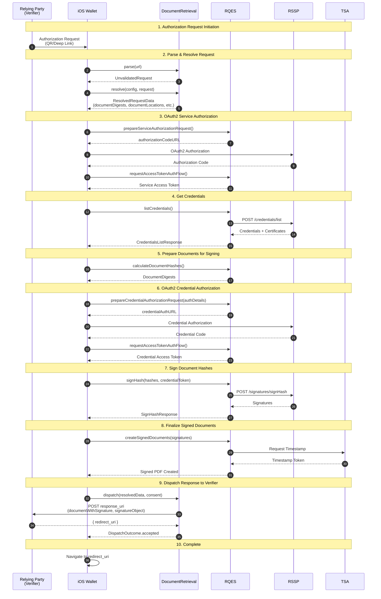

# EUDI RQES CSC Library - Architecture Documentation

This document provides architectural diagrams for the EUDI iOS Remote Qualified Electronic Signature (RQES) library implementing the CSC API v2.0.

---

## 1. High-Level Architecture



---

## 2. Component Diagram



---

## 3. Main Signing Flow - Sequence Diagram



---

## 4. Document Retrieval Flow - Sequence Diagram (OpenID4VP)



---

## 5. Signature Conformance Levels



---

## 6. Document Retrieval - Request Types



---

## 7. Dependency Injection Architecture



---

## 8. HTTP Client Layer

```mermaid
graph LR
    subgraph "HTTP Clients"
        direction TB
        INFO_C[InfoClient]
        TOKEN_C[OAuth2TokenClient]
        CRED_LIST_C[CredentialsListClient]
        CRED_INFO_C[CredentialsInfoClient]
        SIGN_C[SignHashClient]
        TS_C[TimestampClient]
        OCSP_C[OcspClient]
        CRL_C[CrlClient]
        CERT_C[CertificateClient]
    end

    subgraph "Protocol"
        HTTP[HTTPClientType]
    end

    subgraph "Implementation"
        HTTP_SVC[HTTPService]
        URL_SESS[URLSession]
    end

    subgraph "Endpoints"
        INFO_E[/csc/v2/info]
        TOKEN_E[/oauth2/token]
        CRED_LIST_E[/csc/v2/credentials/list]
        CRED_INFO_E[/csc/v2/credentials/info]
        SIGN_E[/csc/v2/signatures/signHash]
        TSA_E[TSA Server]
        OCSP_E[OCSP Responder]
        CRL_E[CRL DP]
    end

    INFO_C --> HTTP
    TOKEN_C --> HTTP
    CRED_LIST_C --> HTTP
    CRED_INFO_C --> HTTP
    SIGN_C --> HTTP
    TS_C --> HTTP
    OCSP_C --> HTTP
    CRL_C --> HTTP
    CERT_C --> HTTP

    HTTP --> HTTP_SVC
    HTTP_SVC --> URL_SESS

    INFO_C -.-> INFO_E
    TOKEN_C -.-> TOKEN_E
    CRED_LIST_C -.-> CRED_LIST_E
    CRED_INFO_C -.-> CRED_INFO_E
    SIGN_C -.-> SIGN_E
    TS_C -.-> TSA_E
    OCSP_C -.-> OCSP_E
    CRL_C -.-> CRL_E
```

---

## 9. Complete End-to-End Flow (Document Retrieval + Signing)



---

## Legend

| Symbol | Meaning |
|--------|---------|
| `→` | Synchronous call |
| `-->>` | Response/Return |
| `-.->` | Default/Optional relationship |
| `alt` | Alternative paths |
| `opt` | Optional block |

## Key Acronyms

| Acronym | Full Name |
|---------|-----------|
| RQES | Remote Qualified Electronic Signature |
| CSC | Cloud Signature Consortium |
| RSSP | Remote Signing Service Provider |
| TSA | Timestamp Authority |
| OCSP | Online Certificate Status Protocol |
| CRL | Certificate Revocation List |
| PKCE | Proof Key for Code Exchange |
| OpenID4VP | OpenID for Verifiable Presentations |
| RP | Relying Party |
